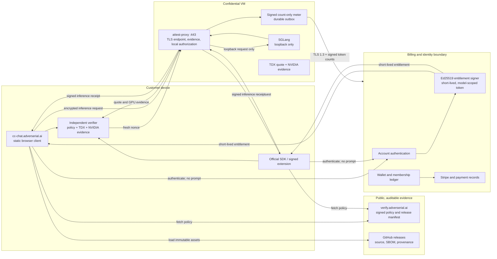
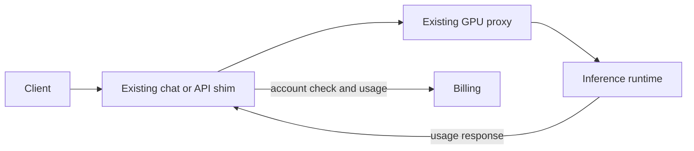

# Confidential inference architecture

This document describes the intended end-to-end confidential-inference
architecture. It is a target design, not a claim that every control is live.
A client must reject an endpoint until it receives fresh hardware evidence,
validates it independently, and finds a matching active policy.

## Target confidential path

### Where TLS ends

`cc-api.adverserial.ai` is an L4/SNI pass-through address. It forwards
ciphertext to `attest-proxy` inside the CVM. The TLS private key and HTTP
termination live there; Heroku, Gandi, the public evidence site, and billing
must never receive the decrypted inference request.

The static chat UI is deliberately outside the CVM. It serves public code only
and must not proxy prompts. The browser connects directly to the attested API
endpoint after verification.

### What billing receives

Billing receives identity and payment data as necessary to operate an account.
For inference settlement it receives only a signed record containing an
entitlement ID, request ID, canonical model ID, input/cached-input/output
counts, timestamp, and meter signature. It does not receive prompts,
completions, attachments, chat history, raw API keys, or model weights.

### Authorization and settlement

1. Billing authenticates the account and reserves the requested maximum
   tokens against membership allowance or wallet funds.
2. Billing returns a short-lived Ed25519-signed entitlement scoped to one
   canonical model, one confidential API audience, a reservation ID, and an
   expiry.
3. The proxy verifies the token locally. It never calls billing in the prompt
   path.
4. After generation, the proxy emits one signed count-only event to a durable
   outbox. It sends that record directly over outbound TLS 1.3 to the fixed
   billing origin. Billing requires the dedicated meter capability **and**
   verifies the proxy Ed25519 signature before idempotent settlement.
5. If the meter cannot deliver an event, its durable outbox retries it. The
   client response is not silently converted into an unbilled request.

## Current transition path

The existing chat and API services remain available while the confidential
path is completed. They are not presented as end-to-end confidential
inference.

The transition path may process request content in conventional application
services. It remains separate until the new browser/SDK-to-CVM path has passed
acceptance tests.

## Evidence needed before production verification

| Control | Required production evidence |
| --- | --- |
| Hardware isolation | Fresh nonce-bound Intel TDX quote and NVIDIA evidence, verified by an independent client verifier. |
| Runtime identity | Active signed policy that pins the proxy image, runtime image, configuration, canonical model artifact digest, and allowed endpoint key. |
| Transport binding | Evidence and policy bind the TLS SPKI fingerprint observed by the client. |
| Chat provenance | GitHub release provenance and an asset-integrity manifest that match the deployed static bundle. |
| Entitlement authority | Public Ed25519 JWK set, short expiries, audience/model binding, replay controls, and issuer key rotation. |
| Meter integrity | Outbound TLS 1.3 to a fixed billing origin, dedicated meter capability, signed count-only JWS, durable outbox, idempotent reservation settlement, and ledger audit trail. A separately deployed mTLS ingress is an optional stronger network boundary. |

## Trust boundaries

- A policy or proxy receipt alone is not hardware verification.
- A browser page cannot establish trust in its own first JavaScript bundle;
  the strongest bootstrap is the official SDK or a signed browser extension.
- Billing need not be inside the inference confidentiality boundary. Its
  entitlement signer and meter verifier can later run in a TEE or use a
  hardware-backed key, but billing must never receive inference content.
- An attested VM is not sufficient by itself. The client must verify fresh
  evidence and reject a mismatch before it sends a prompt.
